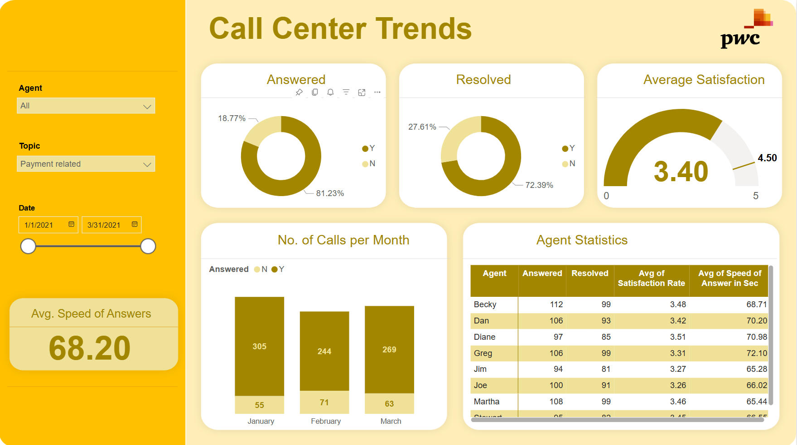

<h1 align="center">PwC Switzerland Job Simulation using Power BI Dashboards</h1>

  
  

## 🖥️ View My Dashboards

- **Call Centre Trends Dashboard:** [View Dashboard](https://app.powerbi.com/links/CK7pMvMlOP?ctid=49674e50-85af-4f8d-973a-02b51c2f5005&pbi_source=linkShare)

- **Customer Retention Dashboards:** [View Dashboards](https://app.powerbi.com/links/GiCvYUqMJm?ctid=49674e50-85af-4f8d-973a-02b51c2f5005&pbi_source=linkShare) *(Multiple Dashboards)*
- **Diversity & Inclusion Dashboards:** [View Dashboards](https://app.powerbi.com/links/bN8uxYL3Y2?ctid=49674e50-85af-4f8d-973a-02b51c2f5005&pbi_source=linkShare) *(Multiple Dashboards)*

## Summary
This collection of **Power BI dashboards** was developed for **PwC Switzerland's Job Simulation (September 2024)** to enhance data visualization, KPI tracking, and executive reporting. The dashboards cover three core areas:

- **Call Centre Trends:** Monitoring and analyzing call centre performance metrics.
- **Customer Retention:** Evaluating customer churn and retention strategies through comprehensive analytics.
- **Diversity & Inclusion:** Examining gender-related KPIs to uncover root causes of gender imbalance in executive management.

By integrating automated reporting solutions, the project achieved a **30% improvement in reporting efficiency** and a **40% reduction in manual processing time**, significantly enhancing the accuracy of business insights and enabling data-driven decision-making.

## Dashboard Breakdown

- **Call Centre Trends Dashboard**  
  Focuses on:
  - Agent performance metrics (e.g., calls answered, resolution rates)
  - Average speed of answer and monthly call volume analysis
  - Identification of common call topics and issues

- **Customer Retention Dashboards**  
  Provide insights into:
  - Customer churn drivers and retention rates
  - Demographic and behavioral analysis of customer segments
  - Performance metrics across multiple retention strategies

- **Diversity & Inclusion Dashboards**  
  Highlight:
  - Gender distribution across various job levels
  - Analysis of promotions, turnover, and executive gender balance
  - Trends and insights supporting targeted diversity initiatives

## Key Insights
- **Enhanced Efficiency:** Automated reporting reduced manual data handling by 40%, boosting both accuracy and timeliness.
- **Diversity Analysis:** Identification of gender imbalances in executive roles has spurred targeted diversity initiatives.
- **Customer Retention:** Detailed analysis of churn drivers supports proactive customer engagement strategies.
- **Call Centre Performance:** Real-time tracking of call centre metrics has enabled more effective resource allocation and performance management.

## Recommendations
- **Diversity Initiatives:** Implement targeted hiring and promotion strategies to address gender imbalances at the executive level.
- **Customer Engagement:** Leverage churn data to refine service offerings, adjust contract terms, and optimize payment methods to reduce cancellations.
- **Call Centre Optimization:** Utilize predictive analytics to forecast call volumes, optimize agent scheduling, and enhance training based on emerging trends.
- **Data-Driven Decisions:** Continue using interactive dashboards to monitor key performance indicators and support agile business strategies.
- **Scalability & Automation:** Expand automated reporting solutions to additional departments to further improve efficiency and accuracy.

